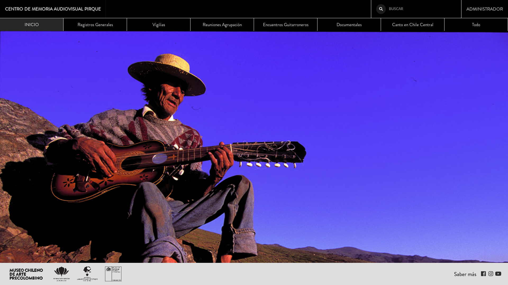

# README: Centro de Memoria Audiovisual de Pirque

### Sobre el proyecto

Este centro de memoria local fue posible gracias al proyecto Centro de Memoria Local de Pirque, folio 479280, presentado por el Museo Chileno de Arte Precolombino, dirigido por Claudio Mercado y financiado por Fondart.

El proyecto consiste en montar en la biblioteca de la Escuela Agroecológica de Pirque una copia de la colección Guitarroneros de Pirque, que forma parte del sistema de archivos de la biblioteca del Museo Chileno de Arte Precolombino.

Un servidor y tres computadores permitirán revisar toda la colección. El sistema es abierto a la comunidad, cualquier persona que desee puede usarlo.
Paralelamente, un taller de audiovisual patrimonial está siendo dictado a 10 alumnos y a cinco profesores de la escuela, para que alimenten el archivo con sus propias creaciones e investigaciones. Tres cámaras de video y tres computadores especializados en edición quedarán en la escuela. Los alumnos del taller audiovisual se harán cargo de este centro, usándolo y haciéndolo crecer.

Participan en este proyecto:
Dirección, coordinación, ejecución, profesor: Claudio Mercado
Producción, profesor: Alejandro Valdeavellano
Coordinador local, profesor: Rodrigo Pino
Informática: Sergio Acuña, Cristóbal Díaz
Gráfica: Renata Teser
Supervisoras de proyecto: Paulina Henríquez, Marcela Parra
Contadora: Erika Doering
Director de la Escuela Agroecológica de Pirque: Roberto Miranda

Museo Chileno de Arte Precolombino
Fundación Origen
Escuela Agroecológica de Pirque
FONDART

### Despliegue

1. Clonar este repositorio en el directorio donde se implementará (ej: /srv/).
2. Configurar base de datos PostgreSQL de nombre 'cmpirque' y usuario de igual nombre. Establecer contraseña y guardarla en texto plano en archivo 'secretkey_db.txt'.
3. Ejecutar script 'update_and_deploy_config.sh'. Adaptar según se requiera.
4. Crear secret key de django en archivo de nombre 'secretkey.txt' en el directorio de la aplicación (utilizar pwgen si se requiere).
5. Crear entorno virtual (/srv/env) e instalar requeriments.txt a través de pip.
6. Chequear archivo uwsgi.ini y configurar nginx/uwsgi para su implementación.
7. Generar migraciones para 'archivopirke' y 'videolog' (makemigrations).
8. Migrar (migrate) y crear super usuario (createsuperuser). 
9. Ejecutar desde shell de django script 'deploy.py'. Adaptar directorio para que tome los archivos adecuados, configurado para (/srv/backup).
